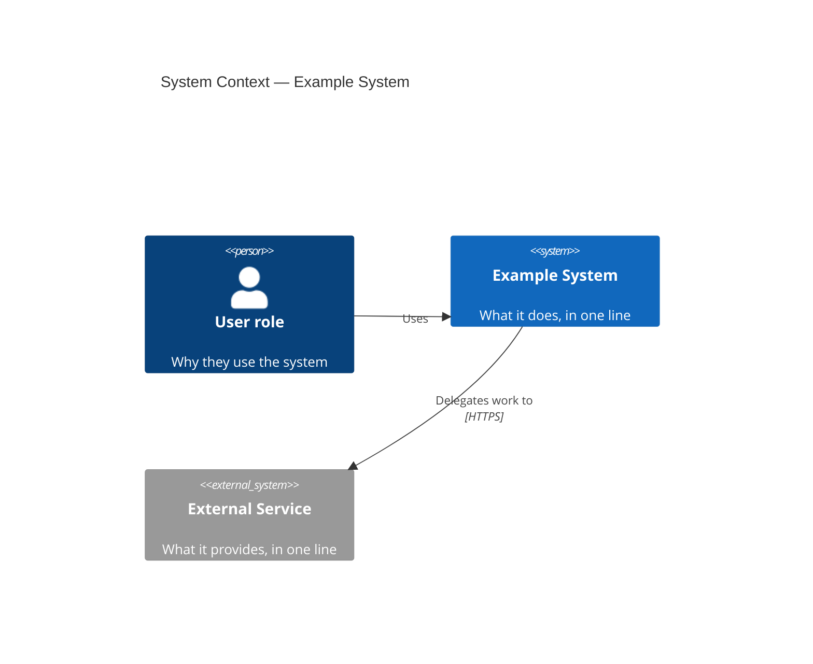
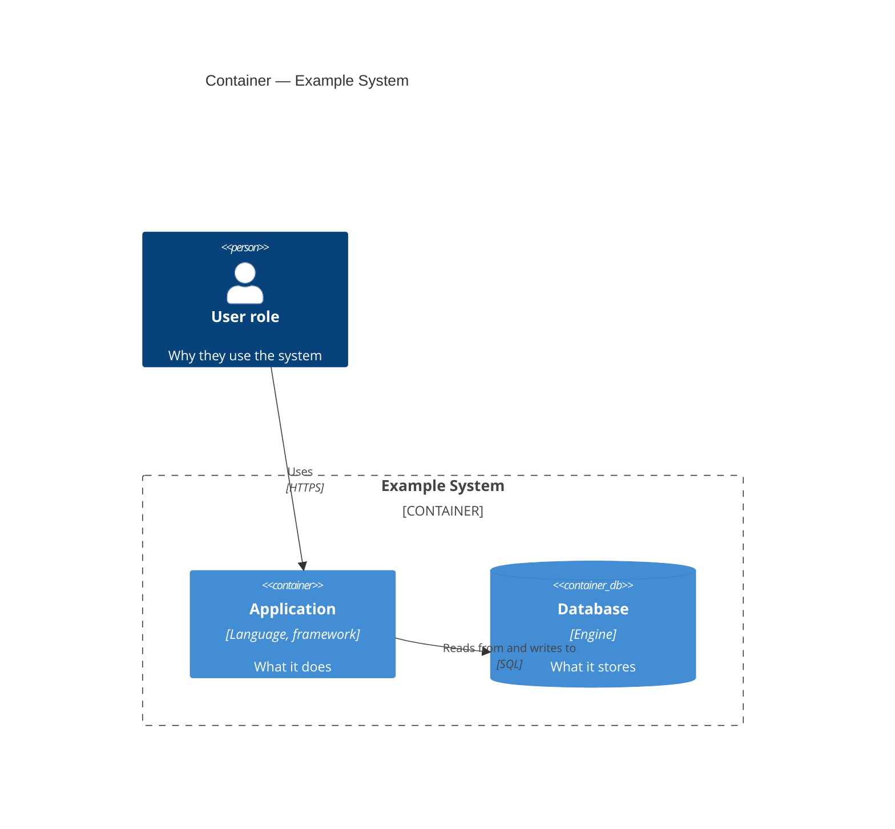

> The general-diagram section synthesizes Anivar Aravind's developer-docs-framework style guide (MIT). The C4 rules are adapted from Peter Knego's diataxis-docs-skill `references/diagrams.md` (original MIT-licensed text describing the [C4 model](https://c4model.com) by Simon Brown; c4model.com content is [CC BY 4.0](https://creativecommons.org/licenses/by/4.0/)). 2026-08-20.

# Diagrams and visual explanation

## When a diagram earns its place

Add a diagram only when it materially improves understanding — system architecture, data flow, process/interaction sequences, state machines. Never decorate prose with a diagram that repeats it. Guidance:

- Keep it simple: more than ~10 boxes means split into multiple diagrams.
- Consistent visual language (colors, shapes, arrows) across a doc set.
- Prefer **text-based formats** (Mermaid, PlantUML) so diagrams version-control and diff cleanly.
- **Accessible:** every diagram carries a text alternative that conveys the same information; don't rely on color alone.
- Screenshots age fast — use sparingly, annotate with numbered callouts, add alt text, and prefer a text description when it will age better. UI screenshots follow `ui-verification.md`.

Choosing a type: sequence/interaction diagram for request/response and callback flows (esp. partner integrations, both sides); flowchart for decision logic and process; state diagram for lifecycles; C4 for architecture (below).

## C4 architecture diagrams (in an *About the architecture* explanation page)

C4 diagrams belong inside explanation prose that carries the *why*; the diagram illustrates it. The page must still pass the explanation closing self-check (compass + bath test) — a diagram dropped in with no surrounding narrative fails it.

**Levels: System Context and Container only.** These are the maintainable levels (C4 practice recommends most teams stop at Container). If Component or Code level is requested, record it as not-created with reason ("below the maintainable line; drifts from code faster than reruns occur") and remedy ("maintain by hand outside the generated set, or use IDE tooling") — never silently draw it. **Thin-repo rule:** a single deployable unit gets a Context diagram only; its Container diagram is not-created ("one container — the Context diagram already shows it"; remedy: "creatable if the system splits into multiple deployable units").

**Every element traces to evidence.** Each person, system, and container maps to something actually found — a dependency, config file, deploy manifest (docker-compose, Kubernetes, Procfile), API client, or documented user role. No invented boxes, no assumed external systems (the diagram equivalent of reference's "no invented API"). Record the evidence source for each element in the working plan, not the published page.

**Notation.** Every element: name + technology + one-line responsibility. Every relationship: a labeled, directed arrow. No mixed abstraction levels in one diagram. Titles name level and system: "System Context — ⟨system⟩", "Container — ⟨system⟩".

**Mermaid mechanics.** Fenced `mermaid` blocks using `C4Context` / `C4Container`, **stable subset only**: `Person`, `System`, `System_Ext`, `Container`, `ContainerDb`, `System_Boundary`, `Container_Boundary`, `Rel`, `Rel_Back`, `title`. The C4 grammar is experimental in Mermaid; that subset is what's stable in practice. **Default styling only** — the C4 defaults are theme-independent and are the canonical c4model.com palette (person `#08427B`, system `#1168BD`, container `#438DD5`, external `#999999`); `UpdateElementStyle`, `UpdateRelStyle`, and `UpdateLayoutConfig` are forbidden (overrides are the first thing to break across renderer versions). If the docs tooling can't render Mermaid, propose the fallback (a plain fenced code block plus a rendering note) as an approvable plan item — never silently degrade. Existing hand-drawn architecture diagrams are classified and annotated keep/move/split like any content; they are never replaced by generated ones without an approved plan item.

### Skeletons

### Closing self-check
Every element traces to a recorded evidence note · only stable-subset keywords, no style/layout directives · each diagram renders (walk the syntax mentally — balanced boundary braces, quoted strings, every `Rel` identifier declared — and verify on a rendering-capable host when available) · each title names level and system · the page still reads as explanation with the diagrams removed.
